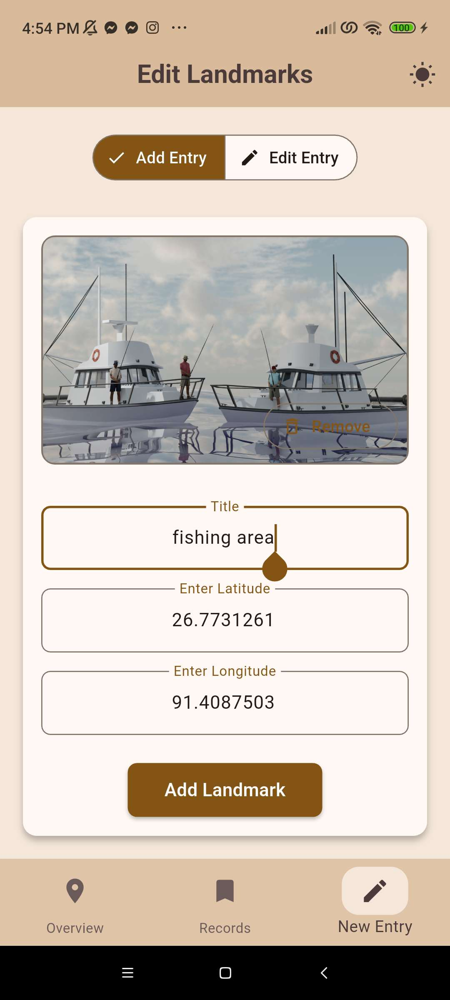
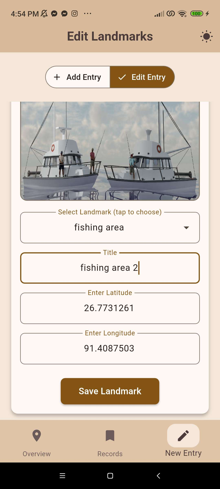
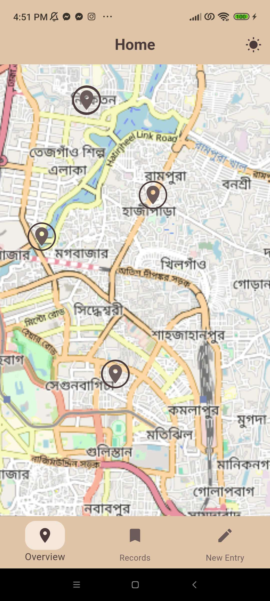
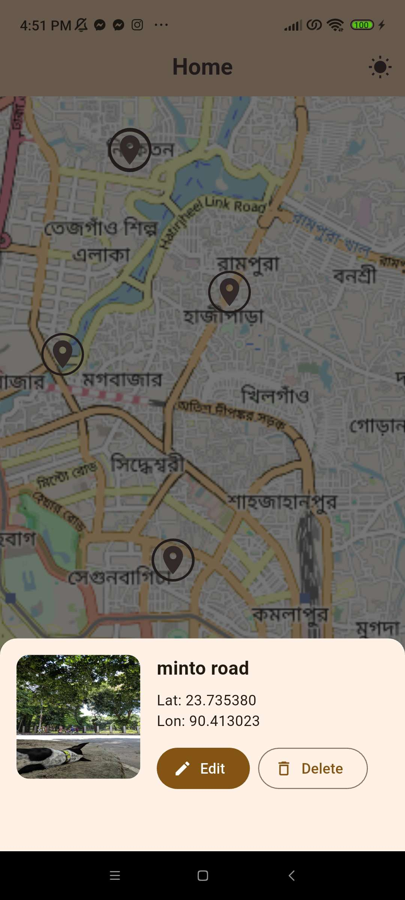
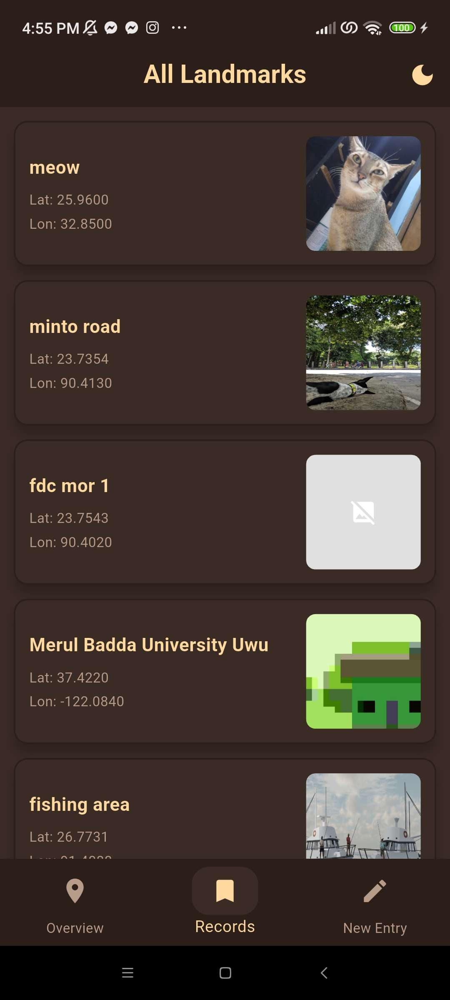
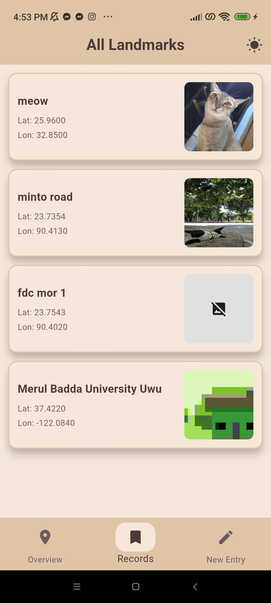

# LandmarkGO

LandmarkGO is a cross‑platform Flutter app to manage geolocated landmarks with a clean, theme‑aware UI. It lets you add new landmarks with images, view them on an OpenStreetMap, and quickly edit or delete entries from list cards or directly from the map.

## App Summary
- A simple, fast way to create and browse landmarks.
- Theme toggle (light/dark) integrated across the app and map markers.
- Overview map (OpenStreetMap) centered and zoomed to your chosen region.
- Records list with swipe actions for quick edit/delete.
- Add/Edit forms with validation, GPS autofill, and simple image handling.

## Features
- **Bottom Navigation:** Switch between `Overview`, `Records`, and `New Entry`.
- **Theme Toggle:** Global light/dark theme via `globals.dart` with reactive colors.
- **REST API:** Full CRUD using `http` with JSON parsing.
- **Records Page:**
	- Swipe to reveal actions; inline quick edit dialog for title/lat/lon.
	- Image previews with loading/error states and delete confirmation.
- **Overview Map:**
	- Uses `flutter_osm_plugin` with large, theme‑colored markers.
	- Tapping a marker opens a bottom sheet showing image, title, lat/lon, and quick edit/delete.
	- Panning/zoom only; no user location marker clutter.
- **New Entry:**
	- Image picking (Add mode only), local resize to JPEG, and multipart upload.
	- GPS autofills lat/lon when adding.
	- Edit mode updates metadata only (title/lat/lon) and previews existing image.
- **Robust Parsing:** Landmark model handles numeric values coming as strings or numbers; null images are safely handled.

## Setup Instructions

### Prerequisites
- Flutter SDK installed and configured.
- Android Studio/Xcode toolchains for device builds.
- Internet access (map tiles and API).

### Install Dependencies
```powershell
flutter pub get
```

### Platform Permissions
- **Android:** Internet permission is included; location permissions are added for GPS autofill.
	- `android/app/src/main/AndroidManifest.xml` includes:
		- `android.permission.INTERNET`
		- `android.permission.ACCESS_COARSE_LOCATION`
		- `android.permission.ACCESS_FINE_LOCATION`
- **iOS:** `ios/Runner/Info.plist` includes location usage descriptions:
	- `NSLocationWhenInUseUsageDescription`
	- `NSLocationAlwaysAndWhenInUseUsageDescription`

### Run the App
```powershell
flutter run
```

## Known Limitations
- **Image change in Edit:** Editing does not change the existing image (by design); only title/lat/lon are updated.
- **Marker matching:** Marker tap resolves landmarks by lat/lon precision; extremely close points may collide.
- **No pagination/caching:** Records list fetches all items; large datasets may impact performance.
- **Offline support:** Map and API require connectivity; offline usage not implemented.
- **Error handling:** Basic to keep UI responsive; consider adding richer retry/reporting flows.

## Project Structure
```
lib/
	main.dart
	includes/
		app_bar.dart
		globals.dart
		nav_bar.dart
	models/
		landmark.dart
	pages/
		overview.dart
		records.dart
		new_entry.dart
	services/
		api_service.dart
```

## License
Proprietary. All rights reserved.

## Screenshots

### Add Entry

Shows the form to create a landmark with title, latitude, longitude, and an image. GPS can auto‑fill coordinates in Add mode.

### Edit Entry

Displays the edit flow where you can update title/lat/lon. Image change is disabled in Edit mode by design.

### Overview Map

OpenStreetMap view centered and zoomed in on your region with large theme‑colored markers.

### Marker Bottom Sheet

Appears when a marker is tapped. Left: image preview. Right: title, coordinates, and quick Edit/Delete actions.

### Records Page (Dark)

List of landmarks with swipe actions (Edit/Delete) rendered in dark theme.

### Records Page (Light)

Same list and interactions rendered in light theme.
